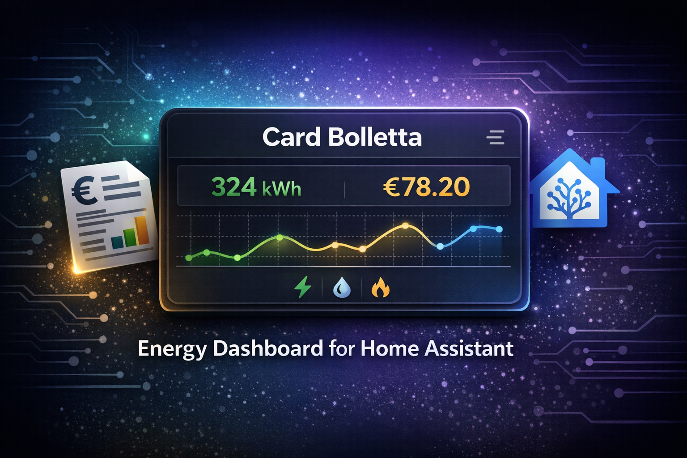
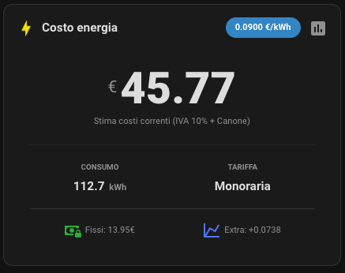
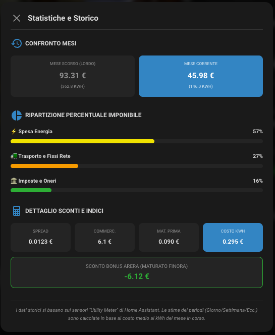
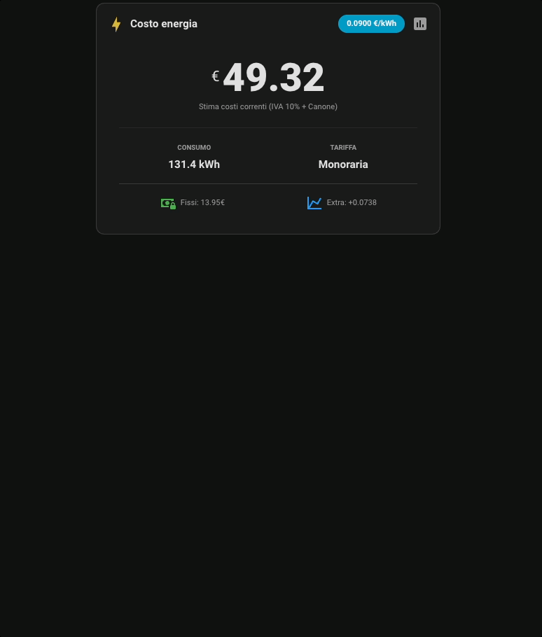

<p align="center">
  
</p>

<p align="center">
  <a href="https://github.com/hacs/integration"></a>
  <a href="https://github.com/elax46/card-bolletta/releases/latest"></a>
  <a href="https://github.com/elax46/card-bolletta/commits/main"></a>
  <a href="http://creativecommons.org/licenses/by-nc-sa/4.0/"></a>
</p>

---

<div align="center">
  
  <h1>Card Bolletta⚡️🇮🇹</h1>
  
  **La tua bolletta elettrica, finalmente trasparente e in tempo reale.**
</div>

<br>

Una custom card per **Home Assistant** progettata specificamente per il mercato elettrico italiano. Non limitarti a vedere i kWh: trasforma i consumi in costi reali includendo ogni singola voce della bolletta italiana.

### ✨ Perché usarla?
* **Calcolo Reale:** Include Materia Prima, Perdite di Rete, Oneri di Sistema, Accise, IVA e Canone TV.
* **Supporto Multi-Fascia:** Gestione automatica delle fasce orarie **F1, F2 e F3**.
* **Statistiche Avanzate:** Confronta i dati storici e analizza la ripartizione dei costi tra quota fissa e variabile.
* **Design Flessibile:** Nuovo layout **Ultra-Compact** per dashboard minimaliste e una vista dettagliata per i "power user".
* **Fatturazione Mensile o Bimestrale:** Scegli il periodo di fatturazione del tuo contratto: la card adatta automaticamente costi fissi, canone TV e bonus sociale.

---

## 📸 Screenshots

<p align="center">
  
  
</p>

<p align="center">
  <i>A sinistra la vista principale standard, a destra il dettaglio delle statistiche e della ripartizione costi.</i>
</p>

<p align="center">
  
</p>

<p align="center">
  <i>Preview della scheda statistiche</i>
</p>


## 🚀 Funzionalità

* **Editor Visuale Integrato (GUI):** Configura tutto facilmente senza toccare una riga di codice.
* **Tariffe Monorarie e a Fasce:** Supporta sia i contratti a prezzo fisso che quelli indicizzati (PUN) inserendo i relativi sensori.
* **Calcolo Completo:** Tiene conto di Spread, Costi di Trasporto, Oneri di Sistema, Accise, PCV, Quota Potenza, IVA e Perdite di Rete.
* **Finestra Statistiche:** Un pop-up integrato che mostra il breakdown completo della bolletta (Imposte, Energia, Trasporto, ecc.) e il confronto con il mese precedente.
* **Auto-rilevamento Mese Precedente:** Legge in automatico l'attributo `last_period` dei tuoi Utility Meter per dirti quanto hai speso il mese scorso.
* **Periodo di Fatturazione Configurabile:** Supporta sia contratti con bolletta **Mensile** che **Bimestrale**, raddoppiando in automatico i costi fissi (PCV, quota potenza, quota fissa rete) e adattando canone TV e bonus sociale quando selezioni il bimestrale.
* **PCV da Sensore:** Oltre al valore fisso, il costo di Commercializzazione (PCV) può essere letto da un sensore (es. un valore annuale) e "spalmato" automaticamente sul numero di mesi indicato, adattandosi poi al periodo di fatturazione scelto.

---

> [!WARNING]  
> Per una stima accurata dei costi in bolletta, è fondamentale utilizzare sensori di consumo affidabili e inserire le voci di costo nel modo più preciso possibile. Si consiglia di sfruttare la funzione **Valore manuale** per la sorgente di consumo, inserendo i dati dell'ultima bolletta così da calibrare al meglio le singole voci di costo.
---

## 🛠️ Prerequisiti: I sensori Utility Meter e PUN

Per sfruttare la card al massimo delle sue potenzialità (specialmente i dati storici e il confronto con il mese scorso), si consiglia di non usare i consumi totali diretti del dispositivo, ma di creare dei sensori mensili, giornalieri, trimestrali ed annuali tramite l'integrazione ufficiale **Utility Meter** (Contatori) di Home Assistant:

* Vai su *Impostazioni -> Dispositivi e Servizi -> Aiutanti -> Crea Aiutante -> Contatore (Utility Meter)*.
* Crea un sensore con ciclo di azzeramento **Mensile** (questo sarà il tuo sensore principale). Se la tua bolletta è **Bimestrale**, crea invece il sensore con ciclo **Bimestrale** e imposta di conseguenza l'opzione "Periodo di Fatturazione" della card.

Nel caso in cui hai un contratto a prezzo variabile, basata sul PUN, ti consiglio di installare l'integrazione [Prezzi PUN del mese](https://github.com/virtualdj/pun_sensor)

---

## 📦 Installazione

### Metodo 1: Tramite HACS

[](https://my.home-assistant.io/redirect/hacs_repository/?owner=elax46&repository=card-bolletta)


1. Apri **HACS** in Home Assistant.
2. Vai su **Frontend** (Interfaccia).
3. Clicca sui tre puntini in alto a destra e seleziona **Repository personalizzati**.
4. Incolla l'URL di questo repository `https://github.com/elax46/card-bolletta` e seleziona come categoria **Lovelace**.
5. Clicca su **Aggiungi** e poi su **Scarica**.
6. Ricarica la pagina del tuo browser.


### Metodo 2: Installazione Manuale

1. Scarica il file `italy-energy-bill-card.js`.
2. Copia il file nella cartella `/config/www/` del tuo Home Assistant (creala se non esiste).
3. Vai in Home Assistant: **Impostazioni** -> **Plance** -> **Risorse** (clicca sui 3 puntini in alto a destra se non lo vedi).
4. Aggiungi una risorsa con URL: `/local/italy-energy-bill-card.js` e tipo di risorsa: **Modulo JavaScript**.
5. Ricarica la pagina.

## Utilizzo

Il modo più semplice per usare la card è tramite l'interfaccia grafica (Editor Visivo):

1. Vai nella tua Dashboard di Home Assistant e clicca su **Modifica plancia**.
2. Clicca su **Aggiungi scheda**.
3. Scorri fino in fondo (o cerca) e seleziona **Custom: Card Bolletta**.
4. Si aprirà l'interfaccia di configurazione:
   * **Periodo di Fatturazione:** Scegli "Mensile" o "Bimestrale" a seconda del tuo contratto. I valori dei costi fissi vanno sempre inseriti "al mese": se scegli Bimestrale la card li raddoppia da sola.
   * **Sezione 1:** Scegli "Sensore (Reale)" e seleziona il tuo sensore Utility Meter (mensile o bimestrale, coerente con il periodo scelto sopra).
   * **Sezione 2, 3, 4, 5:** Compila i campi inserendo i dati del tuo contratto luce (PCV, Spread, Oneri, ecc.). Se hai un costo fisso dell'energia, seleziona "Prezzo Fisso". Se hai il PUN, seleziona "Sensore" e cerca la tua entità del PUN. Anche il costo di **Commercializzazione (PCV)** può essere impostato come valore fisso o letto da un sensore (utile se il tuo fornitore espone un sensore con il costo annuale).
   * **Sezione 6 (Opzionale):** Inserisci qui i tuoi Utility Meter Giornalieri, Settimanali, ecc., se vuoi vederli nel pannello delle statistiche.
5. Clicca su **Salva**.

---

## Opzioni avanzate

Se preferisci l'editor di codice o vuoi copiare/incollare configurazioni preimpostate, ecco come funziona la configurazione YAML.

### Esempio di Configurazione Completa

```yaml
type: custom:italy-energy-bill-card
consumo_entity: sensor.monthly_consumption
periodo_fatturazione: mensile
p1_val: 0.09
quota_fissa_mese: 13.96
title: Costo energia
modo_consumo: ent
consumo_val: 321
perdite_rete: 10
spread: 0.0123
canone_tv: 9
tipo_costo: mono
modo_p1: val
trasporto: 0.018
oneri: 0.0229
accise: 0.0206
pcv: 6.1
modo_pcv: val
pcv_spalma_mesi: 12
fissi_rete: 1.91
contatore_kw: "3"
grid_options:
  rows: auto
  columns: 12
layout: standard
layout_compatto: true
bonus_enabled: true
bonus_valore_giorno: 0.51
```

### Tabella dei Parametri YAML

| Variabile | Descrizione | Default / Opzioni |
|---|---|---|
| `title` | Titolo della card | "Costo Energia" |
| `periodo_fatturazione` | Periodo di fatturazione del contratto | `mensile` o `bimestrale` |
| `modo_consumo` | Origine del consumo principale | `ent` (Sensore) o `val` (Testuale) |
| `consumo_entity` | Entity ID del consumo (mensile o bimestrale, coerente con `periodo_fatturazione`) | es. `sensor.consumo_mese` |
| `tipo_costo` | Tipo di tariffazione | `mono` (Monoraria) o `fasce` (F1/F2/F3) |
| `modo_p1`, `p2`, `p3` | Origine del prezzo (F1, F2, F3 o Mono) | `val` (Fisso) o `ent` (Sensore es. PUN) |
| `p1_ent`, `p1_val` | Entity ID o Valore fisso del prezzo | es. `sensor.pun` o `0.15` |
| `spread` | Spread aggiuntivo del fornitore (€/kWh) | 0 |
| `trasporto`, `oneri`, `accise` | Costi variabili per singolo kWh (€/kWh) | 0 |
| `pcv` | Quota fissa Commercializzazione (€/**mese**, usata solo se `modo_pcv` è `val`; va inserita sempre come costo mensile: se `periodo_fatturazione` è `bimestrale` viene raddoppiata in automatico) | 0 |
| `modo_pcv` | Origine del costo di Commercializzazione (PCV) | `val` (Valore Fisso) o `ent` (Sensore) |
| `pcv_entity` | Entity ID del sensore PCV (usato se `modo_pcv: ent`), tipicamente un valore **annuale** | es. `sensor.pcv_annuale` |
| `pcv_spalma_mesi` | Numero di mesi su cui dividere il valore letto da `pcv_entity` per ottenere il costo mensile (poi adattato al periodo di fatturazione) | 12 |
| `fissi_rete` | Quota fissa Rete/Oneri (€/**mese**, raddoppiata in automatico se bimestrale) | 0 |
| `contatore_kw` | Potenza impegnata contatore | 3 (es. 1.5, 3, 4.5, 6) |
| `prezzo_kw` | Costo mensile per kW di potenza impegnata (raddoppiato in automatico se bimestrale) | 1.98 |
| `canone_tv` | Costo mensile canone RAI (valutato mese per mese sui mesi coperti dal periodo, utile per i bimestri a cavallo di Ottobre) | 0 (Imposta 9 può variare nel corso degli anni) |
| `iva` | Aliquota IVA applicata (%) | 10 (o 22) |
| `perdite_rete` | Perdite di rete applicate alla mat. prima (%) | 10 |
| `consumo_giornaliero_entity` | (Opzionale) Storico per le statistiche | es. `sensor.consumo_oggi` |
| `bonus_enabled` | (Opzionale) Bonus Sociale | es. `bonus_enabled: true/false` |
| `bonus_valore_giorno` | (Opzionale) Bonus giornaliero applicato per POD | es. `0.40` per il valore specifico fare riferimento alla tabella sul sito [Arera](https://www.arera.it/consumatori/bonus-sociale/bonus-sociale-per-disagio-economico/a-quanto-ammontano) |

---

## 💡 Nota sul Calcolo Dinamico (Bonus Sociale e Totale)

La card è progettata per essere **dinamica** e riflettere la spesa reale accumulata fino al momento esatto in cui la consulti. 

A differenza di una bolletta statica, la card aggiorna il calcolo del **Bonus Sociale ARERA** in modalità "pro-rata" (giorno per giorno). Questo evita di vedere un totale falsato all'inizio del mese e permette di monitorare l'andamento della spesa in tempo reale.

### Esempio di calcolo
Se la card mostra un valore che sembra non corrispondere alla semplice sottrazione del bonus mensile intero, è perché sta ragionando sulla maturazione giornaliera:

> **Situazione ipotetica:**
> - **Giorno attuale:** 12 del mese X (quindi 12 giorni di bonus maturati).
> - **Sconto maturato:** $0,51€ \times 12 \text{ giorni} = \mathbf{6,12€}$

Questa logica garantisce che il risparmio cresca proporzionalmente insieme ai tuoi consumi durante tutto l'arco del mese.

> **Nota per la fatturazione Bimestrale:** se imposti `periodo_fatturazione: bimestrale`, la maturazione del bonus (e il confronto con il periodo precedente) viene calcolata sui giorni dell'intero bimestre (mese corrente + mese precedente), non sul singolo mese.

> **Nota sul PCV da Sensore:** se `modo_pcv: ent`, il valore letto da `pcv_entity` viene prima diviso per `pcv_spalma_mesi` (per ottenere il costo mensile equivalente) e poi moltiplicato per 2 se `periodo_fatturazione` è `bimestrale`, esattamente come avviene per il PCV inserito manualmente.

## 💻 Sviluppo

Vuoi contribuire al progetto, modificare la grafica o cambiare i calcoli matematici? Ecco come impostare l'ambiente di sviluppo per testare le modifiche in tempo reale (HMR) bypassando i problemi di cache di Home Assistant.

### 1. Prerequisiti
* Installare [Node.js](https://nodejs.org/) e [Vite](https://vite.dev/) sul proprio computer.
* Avere un editor di codice (es. Visual Studio Code).

### 2. Avviare lo Sviluppo in Tempo Reale
1. Nel terminale avvia il server locale di Vite:
   ```bash
   npm run dev
   ```
   *Vite partirà all'indirizzo `http://localhost:3000` (o l'IP del tuo computer sulla rete locale).*

2. Vai nel tuo Home Assistant: *Impostazioni -> Plance -> Risorse*.
3. Aggiungi (o modifica se già presente) la risorsa della card inserendo l'URL del dev server di Vite. Assicurati di usare l'IP di rete del tuo computer se HA gira su un'altra macchina (es. un Raspberry Pi).
   * **URL:** `http://[INDIRIZZO_IP_DEL_TUO_PC]:3000/italy-energy-bill-card.js`
   * **Tipo:** Modulo JavaScript

Ora, ogni volta che modificherai il file `.js` e salverai, Vite re-compilerà istantaneamente il codice e Home Assistant aggiornerà la card sulla plancia senza dover svuotare manualmente la cache ogni volta!

### 3. Build
Una volta completata la fase di sviluppo puoi esegui il comando di build (`npm run build`). Questo genererà la cartella `dist/` con il file `italy-energy-bill-card.js` pronto per essere caricato sulla tua istanza HA